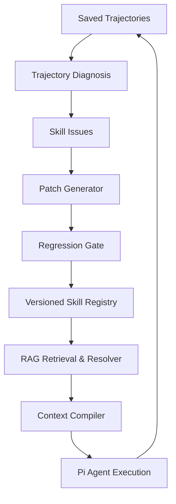

<!-- Purpose: reconcile the implemented MVP with deferred framework targets and
keep unaccepted scale-out architecture clearly separated from active work. -->

# Proposed — 基于 Pi Agent 的 Skill 管理与持续进化框架

> Status: Proposed, reconciled with the implemented MVP on 2026-08-14. This
> document is not an accepted architecture decision or the active execution
> plan; `.plan/next.md` is the current prioritized plan.

Decision 0027 supersedes this proposal's pre-0027 three-Specialist → Synthesis
sequence. Current multi-Trajectory research stops at four independent Specialist
reports; aggregation, evidence loops, attribution, Candidate generation, and
formal user reports remain future work.

## 1. 文档范围

本文设计一个构建在 Pi Agent 之上的 Skill 管理与持续进化框架。假设系统已经能够保存完整 trajectory，包括消息、工具调用、工具返回、错误和最终输出；因此本文从 trajectory 之后的分析、评估、Skill 更新与大规模资产管理开始。

系统需要解决两类问题：第一，在 Skill 创建和早期测试阶段，根据多次任务轨迹检查其完备性、可靠性和可运行性，并生成经过验证的更新；第二，在 Skill 数量达到数千甚至更多时，完成 Skill 搜索、去重、依赖管理、Reference/Asset 更新、长度控制和版本治理。

核心原则是：

1. trajectory 只提供经验和证据，不能直接决定如何修改 Skill。
2. Skill 更新必须经过 evaluation 和 regression gate。
3. Skill、Reference、Asset 和历史经验必须分层存储，不能全部追加进 `SKILL.md`。
4. RAG 用于模糊检索和经验召回；Dependency Graph 用于确定性的依赖解析与影响分析。
5. 所有生产版本都必须可定位、可复现和可回滚。

## 当前实现状态（2026-08-11）

本节是后续阅读本文的入口。它以当前代码、测试和已接受的决策为准，把原始提案拆成
“已实现基线”和“需要实现的增量”。后文保留目标设计细节，但不能据此重新实现一套与
当前领域契约平行的对象。

### 已实现基线

- action-level trajectory、Pi session sidecar、单次 capture、N-run replay 和
  `task.case.v1` 已实现，所有成功、失败、中止与启动失败都会保留。
- `trajectory.profile.v1`、`artifact.comparison.v1`、EvidenceBundle、EvidenceRef、
  脱敏和路径约束已实现，为分析提供确定性事实和可下钻证据。
- 单条 trajectory 的无模型 `trajectory.precheck.v1` 已实现，负责完整性、显式错误状态、
  lifecycle、session 和 artifact 文件事实；语义/因果 prompt 已改为只解释 precheck
  signals。完整流程已封装为 `analyze-single-trajectory` Skill package；严格 parser、
  单-run AgentRun 与脱敏 EvidenceBundle 已实现，prompt 和 contract 已批准。每次分析
  另存一个严格五层用户报告，现有只读 Viewer 可展示结论、经过、问题、证据和下一步。
- 当前 writer、schema、公共代码、CLI、viewer 和维护文档统一使用 Trajectory。历史数据只由
  legacy reader 兼容并标记来源，不双写、不原地改写；5 个真实 doc-to-HTML run 已通过
  packaged Skill 的确定性阶段。
- Package-local `skill_contract.json` 与 `skill.contract.v2` 已正式启用；
  `skill.validation_report.v1` 已实现 thin contract、Skill Markdown、package
  symlink 和 TaskCase 加载的确定性检查。历史 capability contract v1 继续只读。
- Skill-first 层级核心已实现并由决策 `0023`、`0025` 接受：Skill 拥有不可变版本、
  执行、同版本执行批次、单 trajectory 分析和改进方案导航；Skill 版本是强制绑定和筛选标签，
  不增加 UI 必经层。历史数据和中文管理界面已完成切换，读取零写入、五层问题卡、
  `Skill → trajectory → 单 trajectory 分析` 层级菜单、术语解释和 URL 状态已实现。多 trajectory 分析
  尚未实现，已有独立空位置且当前统计为 0；Harness 和旧多角色尝试不再作为其数据源。
- pre-0027 的三个 specialists、Synthesis、最多三轮补证和 hypothesis 领域对象仍为
  兼容代码，不是当前研究入口。当前实现使用完整 raw-Trajectory Harness、双盲测认证、共同
  确定性基线和四个不聚合 Specialist；产品多 trajectory Analysis 仍为 0。
- 一个原子 hypothesis 对应一个完整、不可变的 CandidateSkill。父快照、候选内容、
  framework-computed diff、失败状态和全部 attempts 都会持久化。
- candidate smoke、两个 TaskCase 的 baseline/candidate paired replay、13-run 上限、
  统一 Harness、独立 ReplayJudge 和五类 gate 已实现。
- Docker candidate replay 已实现 fail-closed 边界：禁用 Pi 内置工具、容器无网络、
  不携带 credential、不允许 host fallback。
- `review.package.v1` 已实现完整披露和人工 `approved_for_release|rejected` 决策；自动
  gate 不能发布 Skill。
- 上述分析、candidate、comparison 和 review 主要完成了领域逻辑与 fake 测试；真实
  DeepSeek multi-agent、真实 candidate replay 和正式发布尚未完成。

### 需要实现或验证

| 模块 | 当前状态 | 下一增量 |
| --- | --- | --- |
| Skill-first hierarchy | 核心数据层、历史切换、零写入中文管理界面、单 trajectory 五层展示、层级菜单和稳定 URL 已实现；当前有 11 次执行、10 份单 trajectory 分析和 0 份多 trajectory 分析 | 先获得完整授权并删除七条已从产品隐藏的误分类旧记录，再修复未来执行的版本一致性、临时 Harness 路径和改进方案双轨。 |
| Skill Contract 与初始检查 | Thin v2、固定文件名、parser、EvaluationSuite object/resolver 和 preflight 已实现并接受；目标完整 Suite 仍可处于 proposed | 先批准具体 Suite 并补齐 TaskCase/条件映射；需要 metrics 时发布新 schema 版本。 |
| Trajectory Diagnosis | 十一条单-trajectory precheck/结构化语义报告已接受；raw-Trajectory Harness、双盲测流程与四 Specialist 结果板已实现，但真实研究尚未运行 | 先预装并验真 Docker 镜像、通过 Harness，再审批行为协议/manifest 并运行两次盲测；完整四角色研究还需批准 Suite 和补齐样本。不得启动 Synthesis。 |
| Skill Patch Generator | 既有 `candidate.skill.v1` 核心已实现，待真实验证；新的 hierarchy prototype 错误引入了平行 schema | 删除双轨含义，使用 ownership adapter 把既有 Candidate/Comparison/Review 链挂到 Skill；再运行真实 CandidateProposer。 |
| Regression Gate | 核心已实现，待真实验证和增强 | 先修复 Chrome preflight/诊断/熔断，验证 Docker；再加入 task-specific deterministic validators 和可版本化 evaluation suite。 |
| Release 与 Governance | 人工 review 已实现，发布未实现 | 实现正式 SkillVersion 写入、版本日志和 rollback target；canary 和自动回滚继续延后。 |
| Registry、RAG、Dedup、Dependency、Asset、Context Compiler | 未实现 | 保持为规模化提案；只有真实 MVP 证据和负责人接受 scoped decision 后才能进入当前计划。 |

### 已接受实现对原提案的约束

1. 当前权威链路是
   `analysis.agent_result.v1 → optimization.hypothesis.v1 → candidate.skill.v1
   → comparison.experiment.v1/test.effect.v1 → review.package.v1`。后文的
   `RunAnalysis`、`SkillIssue`、`PatchCandidate` 和 `EvaluationReport` 是目标概念，
   不能直接新增为平行 schema；若需要独立持久化，必须先接受兼容与迁移决策。
2. 一个 hypothesis 生成一个原子 CandidateSkill。原提案“合并同一 root cause 的多个
   SkillIssue”与当前归因边界冲突，不能在未接受新决策时实现。
3. Gate 使用 `improved`、`regressed`、`mixed`、`inconclusive`、
   `not_runnable`，不使用单一总分，也不直接输出发布决定。发布始终需要人工批准。
4. 当前目录不是 Git worktree，候选以完整快照和 framework diff 为权威；独立 Git
   branch 只能在未来 Registry/Git 工作流获批后采用。
5. MVP 使用文件 manifest、JSONL、原子更新、标准库 queue 和 `unittest`。数据库、
   Temporal、S3、Pydantic/FastAPI、pytest 等只能在实际规模瓶颈出现并接受新决策后
   引入。
6. Skill aggregate 不新增第二个权威 `skill.json`。Package 的
   `skill_contract.json`、不可变 `revision.json`、运行 `execution.json` 和可重建
   `index.json/catalog.json` 已分离人审边界、内容身份、运行事实与导航缓存。未来若
   Registry 需要展示 metadata，应新增独立版本化 profile，而不是复制这些权威字段。
7. 层级迁移不能把五次 `invalid_output` 降格成笼统 unavailable，也不能为了只展示
   后五次运行而删除早期失败批次。全部十次 Replay Execution 必须保留，界面差异由
   filter/view 处理。

## 2. 总体架构



围绕这条主链，Dependency Graph 负责 Skill 之间的版本依赖，Asset Manager 负责外部资料，Deduplication 模块负责重复资产识别，Release Manager 负责发布、canary 和回滚。

## 3. 模块总览

| 模块 | 实现状态 | 主要目的 | 当前或目标输出 |
| --- | --- | --- | --- |
| Skill Contract 与初始检查 | Thin v2、checker 和 package-local preflight 已实现并接受 | 绑定 identity、runtime 与 EvaluationSuite 引用 | 当前 `skill.contract.v2` 与 validation report |
| Trajectory Diagnosis | 多-run 领域层和单-trajectory deterministic/LLM 分层已实现，待真实验证 | 从单次或多次 trajectory 中识别可复现、可归因的问题 | 当前 precheck、profile、agent result、hypothesis；目标 issue projection |
| Skill Patch Generator | 核心已实现，待真实验证和集成 | 将问题转化为局部、可审计的修改 | 当前 `candidate.skill.v1` 和 framework diff |
| Regression Gate | 核心已实现，待真实验证和增强 | 判断候选版本是否真实改善且没有退化 | 当前 comparison、Harness、`test.effect.v1` |
| Skill Registry | 未实现 | 管理 Skill 身份、版本、状态和 ownership | 目标 `SkillVersion`、`SkillCard` |
| RAG Retrieval 与 Experience Memory | 未实现 | 搜索 Skill、Reference 和经过验证的历史经验 | 目标 `RetrievalResult` |
| Skill Deduplication | 未实现 | 识别重复、重叠和可合并 Skill | 目标 `DedupDecision` |
| Dependency Graph | 未实现 | 解析依赖、检测循环、计算更新影响范围 | 目标 `DependencyLock`、影响列表 |
| Reference/Asset Manager | 未实现 | 管理外部资料及其与 Skill 的关系 | 目标 `AssetVersion`、更新建议 |
| Context Compiler 与 Compaction | 未实现 | 控制运行时内容和 Skill 长度 | 目标 `SkillBundle`、压缩补丁 |
| Release 与 Governance | 人工 review 已实现 | 管理审查、发布、canary、回滚和审计 | 当前 ReviewPackage；正式发布待实现 |

---

## 4. Skill Contract 与初始检查模块（初始 checker 已实现）

### 4.1 目的

该模块不尝试把 Skill 语义复制、提取或变成统一 ontology。它提供一个稳定细腰层：
身份与审批信息、机器可检查的最大 runtime 边界，以及由 Harness 执行的独立
EvaluationSuite 引用。

没有 Skill Contract，后续只能评价回答“看起来是否合理”，无法稳定判断 Skill 是否完整或发生 regression。

当前 `skill.validation_report.v1` 已检查 v2 contract 结构、审批状态、Skill package
安全形态、`SKILL.md` front matter、主标题、fenced code block 和 TaskCase 加载。
文档可视化 Skill 的 `skill_contract.json` 已获批准并通过检查。历史 v1 contract
仍可读取，但不再是当前 source of truth。

### 4.2 核心字段

当前 runtime 要求 `SKILL.md` 同级存在经过审批的 `skill_contract.json`，并未使用
`skill.yaml`。`skill.contract.v2` 只固定两个实质部分，另加严格的
identity/approval 元数据：

```json
{
  "runtime": {
    "required_tools": ["filesystem.read"],
    "allowed_tools": ["filesystem.read", "process.execute"],
    "allowed_permissions": ["workspace.input.read"],
    "network": "forbidden",
    "credentials_in_sandbox": false,
    "dependencies": [],
    "assets": []
  },
  "evaluation": {
    "suite_refs": ["traffic-data-audit-v1"]
  }
}
```

主要字段含义如下：

| 字段 | 含义 |
| --- | --- |
| identity/approval | 稳定 `skill_id`、版本、owner、前序 contract 和 `proposed|approved`。 |
| `runtime` | registry ID、网络策略和 sandbox credential 边界。 |
| `evaluation` | 独立 EvaluationSuite 引用；不复制 TaskCase、validator 或场景定义。 |

V2 不包含 `semantics`。自动提取的 Skill 摘要以后可以属于非门禁的 `SkillProfile`；
如果需要独立产品规格，应由未来 contract 通过 `spec_ref` 引用，而不是复制 Skill 原文。

### 4.3 功能

1. 按精确 schema 解析当前 v2，并为历史数据保留 v1 reader；同时验证 `SKILL.md`。
2. 检查 required tools 是 allowed tools 的子集，并校验 tools、allowed permissions、
   dependencies 和 assets registry identifier。
3. 对 network 和 credentials 执行 fail-closed policy 检查。
4. 检查身份、版本关系和审批状态。
5. 保存 EvaluationSuite 引用；独立 suite object 和 resolver 仍待实现。
6. 输出结构化 `SkillValidationReport`。

### 4.4 实现细节

静态检查只负责 JSON 形态、registry/reference、安全边界和审批。Contract checker
不解析或评价 `SKILL.md` 的领域语义，也不把文本相似度当作能力证据；行为要求由独立
EvaluationSuite 和 Harness 验证。

建议将检查结果分为 `error`、`warning` 和 `suggestion`。存在 `error` 的 Skill 不能进入动态测试；`warning` 可以进入测试，但不能直接发布为 stable。

### 4.5 输出

```json
{
  "skill_id": "traffic-data-audit",
  "version": "0.1.0",
  "valid": false,
  "errors": [],
  "warnings": [],
  "coverage_gaps": [],
  "token_usage": {},
  "checked_at": "..."
}
```

---

## 5. Trajectory Diagnosis 模块（确定性/LLM 分层已实现，待真实验证）

### 5.1 目的

该模块从多次测试 trajectory 中发现稳定、可复现、能够归因到 Skill 的问题。它的输出不是一段总结，而是带有具体 run 和 step 证据的 `SkillIssue`。

### 5.2 核心字段

当前实现使用 `trajectory.profile.v1` 作为轻量确定性 projection，并使用
`analysis.agent_result.v1` 与 `optimization.hypothesis.v1` 表达诊断结论。下面的
`RunAnalysis` 和 `SkillIssue` 是未来可能增加的 projection，不是当前缺失就必须新增
的平行 schema：

```json
{
  "run_id": "run_03",
  "task_id": "task_02",
  "skill_version": "0.1.0",
  "outcome": "failure",
  "tool_errors": ["column_not_found"],
  "recovery_success": true,
  "metrics": {
    "tool_calls": 12,
    "repeated_calls": 3,
    "tokens": 15400,
    "latency_ms": 82000
  },
  "behavior_tags": ["schema_not_checked", "retry_loop"]
}
```

最终问题对象 `SkillIssue` 包含：

```json
{
  "issue_id": "issue_017",
  "skill_id": "traffic-data-audit",
  "skill_version": "0.1.0",
  "type": "missing_precondition",
  "severity": "high",
  "frequency": {"affected_runs": 4, "total_runs": 10},
  "evidence": [
    {"run_id": "run_02", "step_ids": [4, 5, 6]},
    {"run_id": "run_08", "step_ids": [3, 4]}
  ],
  "root_cause": "Schema inspection is not required before SQL generation",
  "affected_section": "database-query",
  "recommended_change_type": "add_precondition",
  "confidence": 0.87
}
```

### 5.3 功能

1. 为每条 run 计算任务结果、工具错误、重试、循环、成本和延迟。
2. 对错误 signature、行为标签和恢复路径进行聚类。
3. 比较相似任务中的成功轨迹与失败轨迹。
4. 查找成功轨迹中反复出现但 Skill 未声明的步骤。
5. 识别重复调用、无进展区间和不必要的 Reference 读取。
6. 判断失败是否能够归因到 Skill。
7. 为每个问题生成频率、严重度、置信度和证据定位。

### 5.4 实现细节

诊断应采用“规则检测 + 统计聚合 + LLM 解释”的顺序。规则检测负责工具异常、重复调用、循环和成本；统计聚合负责判断问题是否跨 run 重复；LLM 负责解释成功和失败轨迹之间的行为差异。

Root-cause 分类至少包括：

```text
skill_missing_information
skill_ambiguity_or_conflict
stale_reference_or_asset
model_randomness
tool_failure
environment_failure
invalid_test_case
```

只有前三类默认允许进入 Patch Generator。对于模型、工具和环境问题，应当创建其他类型的工程 issue，而不是继续向 Skill 添加补丁。

十次 session 可以发现高频模式，但样本量不足以证明修改一定有效。因此 diagnosis 负责形成优化假设，Regression Gate 负责验证假设。

### 5.5 输出

当前输出保持为 profile、带 EvidenceRef 的 agent findings 和原子 optimization
hypotheses。若真实运行证明跨 campaign 查询需要独立 issue 对象，再提出兼容的
`SkillIssue` projection，以及按严重度、频率和潜在收益排序的 diagnosis report。

单条 run 先由 `trajectory.precheck.v1` 检查 JSONL、schema、identity、`seq`、边界、
显式 action/outcome 状态、session 和 artifact 文件事实。LLM 不重复这些检查，只判断
signal 是否为预期控制流、是否真实恢复、因果/归属、artifact 语义正确性和 Skill
修复适用性。`skills/analyze-single-trajectory/` 已封装该顺序；其 prompt 和 contract
已批准，严格 result parser、冻结证据和单-run AgentRun 已接入。首次五个真实
运行都正常 settled，但因 JSON-only 交付和 EvidenceRef 形状同时漂移而被保存为
`invalid_output`；未接纳其语义结论。下一增量是新版 prompt 和对应 fixtures，
不是放宽 parser。五个失败 attempt 已各自生成 `analysis.single_trajectory_view.v1`；这些报告
只呈现 precheck 事实、“尚不能判断”的边界和重跑建议，并由现有只读 Viewer 展示。

---

## 6. Skill Patch Generator（核心已实现，待真实验证和集成）

### 6.1 目的

当前模块把一个经过证据支持的 `optimization.hypothesis.v1` 转换成局部、可解释、
可回滚的 CandidateSkill。它不直接发布，也不默认重写整个 Skill。未来即使增加
`SkillIssue` projection，也必须先合成为一个原子 hypothesis，再进入候选生成。

### 6.2 核心字段

```json
{
  "patch_id": "patch_009",
  "skill_id": "traffic-data-audit",
  "base_version": "0.1.0",
  "candidate_version": "0.2.0",
  "source_issues": ["issue_017", "issue_021"],
  "expected_effect": "Reduce schema-related query failures",
  "modified_files": ["SKILL.md", "tests/regression.yaml"],
  "change_type": "behavioral_fix",
  "risk": "medium",
  "new_tests": ["schema-mismatch"],
  "diff": "..."
}
```

### 6.3 功能

1. 保持一个 hypothesis 对应一个 CandidateSkill；Synthesis 可以聚合共同 root
   cause，但不能把多个独立 hypothesis 静默合并为一个 candidate。
2. 判断修改应进入核心 Skill、Reference、Asset link、Dependency 还是 tests。
3. 生成最小化 diff。
4. 根据修改内容更新版本号。
5. 为修复的问题自动生成 regression case。
6. 给出预期收益、风险和受影响行为。

### 6.4 实现细节

修改位置遵循以下规则：

| 问题 | 修改位置 |
| --- | --- |
| 核心执行顺序或前置条件缺失 | `SKILL.md` |
| 特定工具或边缘场景细节 | `references/` |
| 新业务知识、schema 或模板 | Asset link |
| 多个 Skill 共用的流程 | Dependency Skill |
| 新发现的失败场景 | `tests/` |
| 过期或错误信息 | 替换或删除旧内容 |

系统应当优先使用 patch，而不是全文重写。任何新增规则都必须链接至少一个 `SkillIssue`；任何删除或替换都必须说明其原始内容由什么新内容取代。

### 6.5 输出

当前输出是包含完整父快照、完整候选内容、framework diff 和来源 hypothesis 的
`candidate.skill.v1` 文件 artifact。新测试可以作为 candidate 内容的一部分，但尚未
自动生成。独立 Git branch、正式 Semantic Version 和 stable registry 需要后续
Registry/发布决策。

---

## 7. Regression Gate（核心已实现，待真实验证和增强）

### 7.1 目的

该模块判断候选 Skill 是否真正改善目标问题，同时没有破坏原有成功能力。它是“生成改进建议”和“允许 Skill 进化”之间的强制边界。

### 7.2 核心字段

当前 gate 由 `comparison.experiment.v1`、统一 Harness 报告和 `test.effect.v1`
共同表达。下面的 `EvaluationReport` 是未来正式发布层可能使用的聚合 projection：

```json
{
  "evaluation_id": "eval_1002",
  "skill_id": "traffic-data-audit",
  "baseline_version": "0.1.0",
  "candidate_version": "0.2.0",
  "suite_version": "traffic-data-audit-v2",
  "environment_lock": {
    "model": "...",
    "tools": {},
    "assets": {}
  },
  "baseline_metrics": {},
  "candidate_metrics": {},
  "regressions": [],
  "decision": "reject"
}
```

### 7.3 功能

1. 在相同任务、模型、工具、Asset 和运行环境下执行 baseline/candidate paired evaluation。
2. 执行 deterministic assertions、状态检查和必要的 LLM judge。
3. 比较成功率、错误率、工具调用、成本、延迟和安全指标。
4. 检查新测试是否通过，以及旧测试是否发生 regression。
5. 计算受影响 dependency Skill 的测试范围。
6. 输出 `improved`、`regressed`、`mixed`、`inconclusive` 或
   `not_runnable`；所有分类都进入人工 ReviewPackage，不直接发布。

### 7.4 实现细节

Evaluator 的可信度排序应为：

```text
deterministic validator
> execution-state validator
> reference-based evaluator
> LLM judge
```

文件是否生成、SQL 是否正确、结果数字是否匹配等问题必须使用程序判断。LLM judge 只用于解释完整性、表达清晰度等无法稳定编码的问题。

发布条件至少包含：

```text
主要目标指标改善
原有成功测试无不可接受退化
安全测试全部通过
成本和延迟处于预算内
受影响依赖的测试通过
```

### 7.5 输出

当前输出完整 comparison manifest、所有 attempts、Harness evidence、独立
ReplayJudge 的 `test.effect.v1` 和人工 ReviewPackage。所有失败、退化和无法运行的
CandidateSkill 都保留。正式 `EvaluationReport` 可以在发布层需要稳定聚合接口时再
增加，但不能代替原始证据或人工发布决定。

---

## 8. Skill Registry（未实现，规模化提案）

### 8.1 目的

Registry 管理 Skill 的稳定身份、不可变版本、状态、owner、适用范围和索引信息。Git 保存内容历史，Registry 提供结构化查询和运行时解析。

### 8.2 核心字段

核心表建议包括：

```text
skills
skill_versions
skill_cards
skill_owners
skill_test_suites
skill_aliases
skill_release_status
```

`skill_versions` 的主要字段：

| 字段 | 含义 |
| --- | --- |
| `skill_id` | 跨版本稳定身份 |
| `version` | 不可变 Semantic Version |
| `content_commit` | 对应 Git commit |
| `content_hash` | 内容完整性校验 |
| `status` | 生命周期状态 |
| `owner_id` | 负责发布和冲突处理的人或团队 |
| `manifest` | 结构化 Skill Contract |
| `created_from_patch` | 产生该版本的 Patch ID |
| `evaluation_id` | 支持发布的评估报告 |
| `created_at` | 创建时间 |

### 8.3 功能

1. 注册新 Skill 和新版本。
2. 维护 `draft → validated → canary → stable → deprecated → archived` 状态。
3. 根据版本约束解析可用版本。
4. 管理 alias、合并和废弃关系。
5. 保存 owner、权限和审查策略。
6. 向检索系统提供标准化 SkillCard。
7. 为运行生成版本锁定信息。

### 8.4 实现细节

发布后的 Skill version 不得原地覆盖。任何内容变更都生成新版本。Registry 中只保存结构化 metadata、索引信息和 Git identity；大型 Reference、Asset 和完整 trajectory 不应直接存入 Skill 记录。

### 8.5 输出

Registry 为其他模块提供 `SkillVersion`、`SkillCard`、版本解析结果和生命周期状态。

---

## 9. RAG Retrieval 与 Experience Memory 模块（未实现，规模化提案）

### 9.1 目的

这是系统中明确引入 RAG 的位置。该模块解决两类模糊检索：第一，根据当前任务找到最合适的 Skill 和 Reference；第二，在诊断或执行时召回与当前问题相似、且已经验证过的历史经验。

RAG 不负责解析显式 dependency，也不负责判断某条经验是否正确。Dependency 由图结构解析，经验是否有效由 Regression Gate 决定。

### 9.2 索引划分与字段

必须建立彼此隔离的索引：

```text
skill_card_index
reference_asset_index
execution_episode_index
failure_pattern_index
validated_lesson_index
```

SkillCard 字段：

```json
{
  "skill_id": "traffic-data-audit",
  "version": "1.4.0",
  "summary": "Audit structured traffic datasets",
  "task_examples": [
    "Find missing time intervals",
    "Detect inconsistent movement counts"
  ],
  "input_types": ["csv", "sql_table"],
  "output_types": ["audit_report"],
  "required_tools": ["python", "postgres"],
  "status": "stable",
  "owner": "data-platform-team"
}
```

Experience memory 字段：

```json
{
  "memory_id": "lesson_031",
  "memory_type": "validated_lesson",
  "task_signature": "postgres schema mismatch during audit",
  "content": "Inspect schema before generating SQL",
  "tool_context": ["postgres"],
  "source_run_ids": ["run_02", "run_08"],
  "source_issue_ids": ["issue_017"],
  "validated_by": "eval_1002",
  "outcome_score": 0.93,
  "valid_from": "...",
  "valid_to": null,
  "supersedes": null
}
```

### 9.3 功能

1. 为 SkillCard、Reference 和验证过的 memory 生成 embedding。
2. 使用 PostgreSQL FTS 执行关键词检索。
3. 使用 pgvector 执行 dense semantic retrieval。
4. 通过 Reciprocal Rank Fusion 合并两个结果列表。
5. 使用 CrossEncoder 对候选项进行 rerank。
6. 根据工具、输入类型、版本、owner、权限和状态进行 metadata filter。
7. 返回带来源、版本和相关性解释的结果。

### 9.4 检索流程

Skill 搜索流程：

```text
当前任务描述
→ 提取task type、input/output和tools
→ metadata pre-filter
→ BM25 top-N + dense top-N
→ RRF fusion
→ CrossEncoder rerank
→ dependency compatibility check
→ 返回top-K SkillCards
```

经验召回流程：

```text
当前任务目标 + 工具 + 错误signature + 环境
→ 搜索validated lessons和failure patterns
→ 过滤过期、未验证和工具版本不兼容的memory
→ rerank
→ 返回少量相关经验
```

经验检索的排序不应只有语义相似度，可以使用：

\[
S(m)=\alpha S_{semantic}+\beta S_{BM25}+\gamma S_{tool}+\delta S_{outcome}+\epsilon S_{recency}-\lambda S_{staleness}
\]

### 9.5 实现细节

不要对完整 `SKILL.md` 只生成一个 embedding。Skill 搜索应主要索引短小的 SkillCard；选中 Skill 后，再由 Context Compiler 加载具体内容。

未经 Regression Gate 验证的 diagnosis 和 patch 不得进入 `validated_lesson_index`。失败 episode 可以进入 `failure_pattern_index`，但必须明确标注其结果为 failure，避免系统把失败路径当成推荐工作流。

建议技术栈：PostgreSQL FTS、pgvector、RRF 和 SentenceTransformers CrossEncoder。数千个 Skill 的规模不需要单独部署向量数据库。

### 9.6 输出

```json
{
  "query": "...",
  "results": [
    {
      "object_type": "skill_card",
      "object_id": "traffic-data-audit@1.4.0",
      "rank": 1,
      "retrieval_sources": ["bm25", "dense"],
      "rerank_score": 0.91,
      "matched_fields": ["task_examples", "required_tools"]
    }
  ]
}
```

---

## 10. Skill Deduplication 模块（未实现，规模化提案）

### 10.1 目的

该模块在新 Skill 创建时和周期性治理时识别重复、部分重叠、可扩展或应当合并的 Skill，避免 Skill 数量无控制增长。

### 10.2 核心字段

```json
{
  "comparison_id": "dedup_010",
  "candidate_skill": "new-data-audit@0.1.0",
  "existing_skill": "traffic-data-audit@1.4.0",
  "semantic_similarity": 0.88,
  "structural_similarity": 0.76,
  "behavioral_overlap": 0.91,
  "differences": [],
  "decision": "extend",
  "confidence": 0.86
}
```

### 10.3 功能

1. 使用 RAG 召回最相似的现有 Skill。
2. 比较 task、input/output、tools、dependencies 和执行阶段。
3. 在代表性任务上比较新旧 Skill 的行为结果。
4. 给出 `reuse`、`extend`、`compose` 或 `create` 决策。
5. 周期性聚类全部 SkillCard，发现历史形成的重复资产。
6. 管理 alias、deprecated 和 merged-into 关系。

### 10.4 实现细节

Embedding 相似不能直接判定重复。例如两个 Skill 都涉及 SQL，但一个负责查询，一个负责 schema migration，它们语义接近但行为不同。最终判定必须结合结构签名和 representative task evaluation。

公共步骤不一定需要合并整个 Skill，也可以抽取成新的 dependency Skill，再由两个 Skill 共同引用。

### 10.5 输出

输出 `DedupDecision`、差异说明和推荐的 registry mutation。任何自动合并都必须经过 owner 审查和 regression tests。

---

## 11. Dependency Graph 模块（未实现，规模化提案）

### 11.1 目的

该模块管理 Skill 之间显式、可执行、带版本的依赖关系，并计算一个 Skill 更新后需要重新测试的资产范围。

### 11.2 核心字段

```json
{
  "source_skill": "traffic-data-audit",
  "source_version": "1.4.0",
  "target_skill": "sql-data-access",
  "version_constraint": "^2.1",
  "resolved_version": "2.1.3",
  "dependency_type": "runtime",
  "required": true
}
```

建议的关系表：

```text
skill_versions
skill_dependencies
skill_asset_refs
skill_test_suites
dependency_locks
```

### 11.3 功能

1. 解析 Semantic Versioning 约束。
2. 为每次执行生成精确 dependency lock。
3. 检测循环依赖和无法解析的版本。
4. 计算 transitive dependencies。
5. 查询 reverse dependencies。
6. 根据版本更新计算受影响 Skill 和测试集。
7. 阻止依赖不完整的 Skill 进入 canary 或 stable。

### 11.4 实现细节

Dependency 必须由 manifest 显式声明，不通过 GraphRAG 从自然语言猜测。关系数据已经结构化，因此 PostgreSQL edge table 和 recursive CTE 更可靠，也更容易审计。

每次运行必须保存实际解析出的 lock，而不是只保存版本范围。否则后续相同任务可能加载不同 dependency，无法复现行为。

### 11.5 输出

输出 `DependencyLock`、循环或冲突报告、直接和间接受影响 Skill 列表，以及 Regression Gate 需要执行的测试集合。

---

## 12. Reference/Asset Manager（未实现，规模化提案）

### 12.1 目的

该模块管理外部业务资料、schema、模板、工具文档和示例，并控制它们如何被 Skill 引用、升级和废弃。

### 12.2 核心字段

```json
{
  "asset_id": "traffic-data-schema",
  "version": "3.2.0",
  "type": "schema",
  "content_hash": "...",
  "source": "...",
  "owner": "data-platform-team",
  "security_classification": "internal",
  "valid_from": "...",
  "valid_to": null,
  "supersedes": "3.1.0",
  "compatible_skill_versions": ["traffic-data-audit@^1.4"]
}
```

### 12.3 功能

1. 导入并解析新 Reference/Asset。
2. 计算内容 hash、版本、来源和安全分类。
3. 建立可搜索的 AssetCard 和分段索引。
4. 使用 RAG 发现可能相关的 Skill。
5. 使用显式引用图计算直接和间接影响。
6. 生成 `link`、`replace`、`supersede` 或 `ignore` 建议。
7. 触发受影响 Skill 及 dependents 的回归测试。

### 12.4 实现细节

新资料不应复制到多个 `SKILL.md`。Skill 只保存 asset ID、版本约束和加载条件：

```yaml
assets:
  - id: traffic-data-schema
    version: "^3.0"
    load_when:
      - input_type == "traffic-database"
```

RAG 只用于产生“可能相关”的候选关系。正式关系写入 `skill_asset_refs` 后，后续解析和影响分析都使用确定性关系。

### 12.5 输出

输出 `AssetVersion`、候选 Skill 列表、影响报告、建议的 reference diff 和需要执行的测试集合。

---

## 13. Context Compiler 与 Compaction Manager（未实现，长期提案）

### 13.1 目的

Context Compiler 为具体任务生成最小且完整的运行时 SkillBundle；Compaction Manager 控制 Skill 长期更新造成的长度、重复和冲突问题。

### 13.2 核心字段

每个可加载内容块应有稳定 ID 和 metadata：

```json
{
  "block_id": "core.preconditions.schema-check",
  "source_type": "skill_core",
  "source_id": "traffic-data-audit@1.4.0",
  "content": "Inspect schema before generating SQL",
  "load_conditions": ["tool:postgres"],
  "token_count": 8,
  "supersedes": null
}
```

运行时 `SkillBundle` 应记录：

```json
{
  "bundle_id": "bundle_901",
  "root_skill": "traffic-data-audit@1.4.0",
  "dependency_lock": {},
  "asset_lock": {},
  "loaded_blocks": [],
  "retrieved_memories": [],
  "total_tokens": 7200,
  "compiler_version": "0.3.0"
}
```

### 13.3 功能

1. 加载核心 `SKILL.md`。
2. 解析并加载 dependency instructions。
3. 根据任务选择相关 Reference/Asset sections。
4. 从 RAG memory 中加载少量相关 validated lessons 或 failure warnings。
5. 执行冲突、重复和 token budget 检查。
6. 生成最终运行时 prompt/context bundle。
7. 周期性提出删除、替换、拆分或 dependency extraction 建议。

### 13.4 实现细节

Skill package 应分层：

```text
SKILL.md       稳定、短小的核心流程
references/    工具和场景细节
assets/        外部事实和业务资料
dependencies   共享工作流
tests/         失败案例和回归约束
CHANGELOG.md   历史变化
```

每层单独设置 token budget。新知识默认进入 Reference 或 Asset；只有改变主要决策顺序、前置条件或失败处理的内容才进入核心 Skill。

Compaction 检查：

```text
重复规则
相互冲突的规则
已被新版本替代的规则
已经抽取为dependency的公共流程
应当移动到reference的细节
没有证据和测试支持的历史补丁
```

删除不能只依据“近期没有使用”。任何压缩补丁都必须重新运行 regression suite。旧内容保留在 Git 历史和 CHANGELOG 中，不留在当前执行文本中。

### 13.5 输出

输出可复现的 `SkillBundle`、token 分配报告、冲突报告和候选 compaction patch。

---

## 14. Release 与 Governance 模块（人工审阅已实现，其余待实现）

### 14.1 目的

该模块把通过测试的候选版本安全地转化为生产版本，并提供审查、canary、审计和回滚能力。

当前只实现 ReviewPackage、完整披露和人工批准/拒绝。人工批准后的正式 SkillVersion
写入、版本日志与 rollback target 尚未实现；canary、监控和自动回滚继续作为长期
提案，不能从当前 review 状态推断为可用能力。

### 14.2 核心字段

```json
{
  "release_id": "release_120",
  "skill_id": "traffic-data-audit",
  "version": "1.5.0",
  "patch_id": "patch_009",
  "evaluation_id": "eval_1002",
  "approval_policy": "owner_required",
  "approvals": [],
  "rollout_stage": "canary",
  "traffic_percentage": 10,
  "rollback_version": "1.4.0",
  "released_at": null
}
```

### 14.3 功能

1. 生成 Git diff、evaluation report 和 dependency impact report。
2. 根据风险等级执行自动或人工审查。
3. 将新版本部署到 canary 流量。
4. 监控成功率、错误率、成本和异常行为。
5. 将通过 canary 的版本晋级为 stable。
6. 在指标退化时自动回滚。
7. 保存完整发布和审批审计记录。

### 14.4 实现细节

高风险 Skill、涉及写操作的 Skill 和具有广泛 reverse dependencies 的 Skill 必须人工批准。低风险文档修复可以自动进入 canary，但不能绕过 regression tests。

每次生产执行必须记录：

```text
root skill version
dependency lock
asset hashes
retrieved memory IDs
model version
tool versions
compiler version
```

### 14.5 输出

输出稳定版本、canary 监控结果、审批记录和可立即使用的 rollback target。

---

## 15. 推荐技术栈（未接受，规模化阶段候选）

下表不是当前 MVP 的依赖清单。当前实现继续遵循文件存储、标准库 queue、单
orchestrator 和 `unittest`。只有对应瓶颈已经出现、迁移成本和回滚方案明确，并由
负责人接受新的架构决策后，才能选择下列组件。

| 层级 | 技术 |
| --- | --- |
| 主服务 | Python、FastAPI、Pydantic |
| 工作流编排 | Temporal Python SDK |
| Registry 与关系数据 | PostgreSQL |
| 全文与向量检索 | PostgreSQL FTS、pgvector |
| Reranker | SentenceTransformers CrossEncoder |
| Raw trajectory 与大型 Asset | S3/MinIO |
| 批量轨迹分析 | Polars、DuckDB、Parquet |
| Skill source of truth | Git |
| Schema migration | Alembic |
| 测试 | pytest、task-specific validators |
| 可观测性 | OpenTelemetry |

## 16. 推荐构建顺序

### 阶段零：验证已实现的 MVP

1. 明确预装并验真固定 Docker 研究镜像，对冻结五-Trajectory batch 运行确定性 Harness；
   不自动拉取，也不回退宿主执行。
2. Harness 通过后，负责人审核行为研究协议和 Harness manifest；运行两个全新盲测
   session，并分别完成隐藏基准人工复核，只有两次都通过才签发 capability certificate。
3. 批准四份 Specialist 协议和完整 EvaluationSuite，补齐六类目标所需样本与映射，再
   运行四个不聚合 Specialist；保存全部失败和重试，不运行 Synthesis。
4. 实现已接受但尚缺失的 Chrome 一次性 preflight、有限 stderr、batch 级崩溃熔断
   及其回归测试；Docker preflight 失败时继续 fail closed。
5. 在安全前置条件满足后，运行一个真实 CandidateProposer、candidate smoke、paired
   comparison、独立 ReplayJudge 和人工 ReviewPackage，证明现有领域对象能形成完整
   非生产闭环。

### 阶段一：补齐单 Skill 质量闭环

1. 为目标 Skill 批准并执行具体 EvaluationSuite，补齐 TaskCase/条件映射；需要 metrics
   时发布新 schema 版本。不要创建平行的 `skill.yaml` source of truth。
2. 审核并实现单-trajectory error report/runner，再根据真实分析输出决定是否补充稳定的
   root-cause taxonomy、跨 run 聚合及必要的正式 issue
   projection。
3. 为目标 Skill 建立可版本化、task-specific 的 deterministic evaluation suite，
   并把自动生成或人工确认的 regression TaskCase 接入 comparison。
4. 提供从分析结论到 candidate、comparison、Judge 和 ReviewPackage 的完整用户入口。
5. 实现人工批准后的 SkillVersion 写入、版本日志和明确 rollback target。该阶段仍不
   自动发布 stable。

### 阶段二：Skill 资产化（需要新的 scoped decision）

在文件扫描、版本解析或多 Skill ownership 出现实际需求后，设计 Registry、不可变
正式版本、owner、生命周期状态和 Git identity。先确定从当前文件 manifest 的迁移
与回滚方式，再选择存储技术。

### 阶段三：引入检索（需要新的 scoped decision）

Registry 稳定后，再建立 SkillCard、Reference/Asset 和 validated experience 的隔离
索引。RAG 首先用于 Skill 搜索，其次用于经过 Regression Gate 验证的经验召回；未经
验证的 diagnosis 或 patch 不能进入 validated memory。

### 阶段四：规模化管理（延后）

在真实 Skill 数量和依赖复杂度证明需要后，构建 Deduplication、Dependency Graph 和
Asset Manager。显式依赖与影响分析保持确定性，RAG 只用于发现候选关系。

### 阶段五：长期治理（延后）

构建 Context Compiler、Compaction、canary、自动回滚和治理 dashboard。任何自动
发布权限都需要单独决策，且不能追溯性地绕过既有人工 ReviewPackage。

## 17. 最终系统边界

最终系统中，不同组件承担不同责任：

```text
Trajectory Diagnosis：发现问题
Evaluation：判断问题和修改是否成立
Patch Generator：提出局部修改
Skill Registry：管理正式资产和版本
RAG：搜索Skill、Reference和经过验证的经验
Dependency Graph：解析显式依赖和影响范围
Context Compiler：控制运行时加载内容
Release Manager：批准、发布和回滚
```

最重要的约束是：RAG 可以找到与当前任务相似的内容，但不能决定它是否正确；trajectory 可以暴露行为问题，但不能直接触发生产 Skill 更新；只有通过 Regression Gate 的经验和修改，才能进入可复用的 Skill 或 validated memory。
