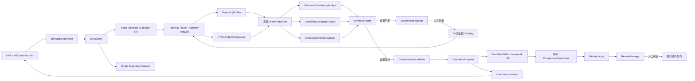

# Skill Evolution MVP 架构

> Purpose: preserve the pre-Decision-0027 architecture baseline and identify
> which boundaries have been superseded by the current implementation.

状态：Historical baseline。Skill-first 核心决策仍有效；本文的旧多 Agent、Synthesis、
补证与 Candidate 自动后继已由 Decision 0027 取代，不是当前可运行流程。  
更新日期：2026-08-14

> **Current multi-Trajectory authority:** 当前实现是 readiness → 冻结 raw Trajectory/index/baseline
> → Docker Harness → 两次盲测与人工复核 → capability certificate → 四个隔离
> Specialist → 不聚合结果板。Synthesis、归因、补证、Candidate 和用户报告均需未来
> 另行批准。以 [Decision 0027](../.memory/decisions/0027-research-harness-before-specialists.md)、
> [多 Trajectory 研究说明](multi-pi-analysis.md)和[当前状态](../.memory/current.md)为准。

## 1. 目标

本项目把 skill 当作可执行软件包：先用确定性 Harness 保存执行事实，再由多个相互
独立的 Pi agent 从不同角度分析证据；证据充分时生成原子
`CandidateSkill`，证据不足时提出补证申请；候选经过隔离的
baseline/candidate replay 后，所有结果都进入人工发布审阅。

系统优先保证：

- 可追溯：结论能回到 trajectory `seq`、报告 JSON pointer、artifact 行号或
  selector；
- 可审计：成功、失败、不确定、未通过门禁的记录都保留；
- 可恢复：文件 manifest 是权威状态，内存 queue 只传对象 ID；
- 安全：分析只读，候选只改候选副本，自动 replay 不能回退到宿主机执行；
- 人工控制：production prompt、探索性 replay 和最终发布都需要负责人批准。

当前不建设数据库、分布式调度器、通用自治 agent 平台，也不使用单一质量总分。

### 1.1 当前数据归属

运行时的主路径已经由 Campaign-first 改为 `Skill -> Execution`。Skill package 的
`skill_contract.json` 继续负责身份、审批、运行边界和 EvaluationSuite 引用；完整
package 形成不可变 Revision；每个 Execution 必须绑定 Revision，并拥有 Input、
Output、Trajectory、session 和单 Trajectory Analysis。Replay 只是同 Revision 的 Execution
Set，多 Trajectory Analysis 归属于 Skill。

系统不新增第二个权威 `skill.json`。Revision/Execution/Analysis manifest 是运行事实，
`catalog.json/index.json` 只是可重建导航缓存。Dependency Graph 只保留稳定 ID、
Revision、tools/dependencies/assets 这些未来输入，本轮不实现。

核心层级已实现，但在历史 cutover 前仍需修复四类兼容问题：执行必须只使用冻结
Revision 快照；Harness/analysis 不得持久化临时 Campaign 路径；Improvements 必须复用
现有 Candidate/Comparison/Review schema 与门禁；Viewer GET 必须零写入并完整呈现单/
多 Trajectory 用户报告。

## 2. 总体流程（pre-0027 历史设计）

下图保留用于解释早期组件来源，不表示当前多 Trajectory research 的自动执行顺序。



Capture、Harness、Analysis、Experiment、Candidate、Comparison 和 Review 是
独立 workflow，但都归属于同一个 Skill aggregate。Agent 只能返回结构化 JSON，
不能直接修改 Execution Set 或 workflow 状态；状态迁移由 Python 编排层在校验结果
后完成。旧 Campaign reader 只是 legacy adapter，不是新路径中的内部中间对象。

## 3. 已实现的组件

### 3.0 Skill Contract 初始检查

`scripts/skill_contract.py` 对 package-local `skill_contract.json`、Skill package 和
TaskCase suite 运行只读、确定性检查，生成 `skill.validation_report.v1`。它校验
thin contract 结构与审批状态、runtime 边界、`SKILL.md` front matter 和 Markdown
边界、symlink 以及 TaskCase 可加载性。

报告的 `valid` 只表示没有结构错误；`dynamic_test_ready` 还要求 contract 已批准。
Contract 不包含 Skill semantics，因此 checker 不声称已经验证领域能力或执行了
EvaluationSuite。
详见 [Skill Contract](skill-contract.md)。

### 3.1 TaskCase、Capture 与 Replay

`task.case.v1` 定义输入交付、能力标签、预算和预期产物：

- `delivery=file` 保留原始文件名和扩展名，运行副本位于
  `artifacts/input/<原文件名>`；
- `delivery=inline_text` 将正文作为结构化数据注入 prompt，不伪造输入文件；
- `expected_artifacts` 支持多个相对路径；
- 路径逃逸、重复产物和向输入、skill、runtime 目录写产物会被拒绝。

`scripts/replay.py` 在一个 campaign 中串行执行 N 次，每个 run 保存独立的
action-level trajectory、Pi session 和 artifacts。执行失败不会阻止后续 run，
也不会被 campaign 隐藏。执行细节见
[TaskCase](task-case.md)、[Replay](replay.md) 和
[Trajectory 定义](trajectory-definition.md)。

支持 TaskCase 的 execution prompt v2 已写入仓库，但 sidecar 仍为
`proposed`；负责人批准前不能用于真实 Pi 调用。

### 3.2 正式 Harness

`scripts/harness.py` 把两个只读组件组合成 `harness.run.v1`：

1. `TrajectoryProfiler` 生成 `trajectory.profile.v1`；
2. `HTMLArtifactComparator` 生成 `artifact.comparison.v1`；
3. 固定截图失败时保留静态结果，并把 Harness 标记为 partial。

Profiler 记录每条 run 的模型调用数、非累计 token 口径、费用、耗时、工具动作、
失败、重试、重复读取、临时 generator、分段写入、合并和返工；跨 run 汇总最小值、
中位数、最大值、离散系数和异常 run。动作摘要保留类别，完整命令通过
`run_id + seq` 回到原 trajectory。

Comparator 提取 HTML 的 DOM、标题树、地标、class、组件、锚点、ARIA、表格、
外部依赖、CSS variables、颜色、字体、媒体查询、脚本规模和可见文本；对
Markdown 来源记录标题、数字、URL、表格和规范化文本块的保留事实，并输出
artifact 两两差异。它不产生总分、排名或“最佳产物”。

截图使用临时 HTML 副本，注入禁止外部网络的 CSP、reduced-motion 和浏览器探针；
原 artifact 不会被修改。详情见 [Harness](harness.md) 和
[Artifact Comparator](artifact-comparator.md)。

单条 trajectory 的错误分析也遵守相同边界。`scripts/trajectory_precheck.py` 先生成
`trajectory.precheck.v1`，确定性检查 JSONL/schema/run identity/`seq`/边界、显式失败、
lifecycle、session 和 artifact 文件事实。它不执行 trajectory 中的代码或命令。
TrajectoryErrorAnalyst 只解释预期控制流、恢复效果、语义完成度、因果关系、归属和 Skill
修复适用性，并且只按 precheck signal 下钻必要的 `seq`。完整说明见
[单轨迹错误分析](single-trajectory-analysis.md)。

### 3.3 EvidenceBundle 与证据引用

`EvidenceBundleBuilder` 把 frozen campaign、Profiler 报告、Comparator 报告、
artifact、经过脱敏的 trajectory 和 `skill_contract.json` 复制到
`evidence.bundle.v1`。它：

- 保留 trajectory 原 `seq`；
- 移除 hidden reasoning、credential 和完整环境映射；
- 不包含 Pi session；
- 对所有 evidence 读取和引用路径拒绝绝对路径、`..` 和 symlink escape；bundle
  provenance 中保存的源目录元数据不作为可读取路径。

`evidence.ref.v1` 可以引用：

- `campaign_id + run_id + seq`；
- `report_path + json_pointer`；
- `artifact_path + line/selector`。

AgentRun 被判为成功前，框架会验证其证据引用确实存在于该 AgentRun 的冻结
EvidenceBundle 中。

独立 ReplayJudge 使用 `ComparisonEvidenceBundleBuilder`，在上述内容之外加入
comparison manifest、candidate manifest 和 framework diff。

### 3.4 历史 MultiPiOrchestrator（当前入口已取代）

> **Superseded for current multi-Trajectory research by Decision 0027.** 以下六角色
> 说明只记录 pre-0027 设计；`analysis_campaign.py` 现已失败关闭，当前生产者是共同
> 确定性基线加四个独立 Specialist，且没有 Synthesis。

`MultiPiOrchestrator` 固定六个角色：

| 角色 | 职责 |
|---|---|
| `OutcomeConsistencyAnalyst` | 从 artifact 差异回溯执行分叉 |
| `CapabilityCoverageAnalyst` | 对照 Contract 引用的 EvaluationSuite 识别覆盖缺口 |
| `ResourceEfficiencyAnalyst` | 下钻高成本 run、返工和可脚本化步骤 |
| `SynthesisAgent` | 合并 findings、反证、冲突和缺失角色 |
| `CandidateProposer` | 一次只实现一个原子假设 |
| `ReplayJudge` | 独立解释 baseline/candidate 结果 |

每个角色使用一个新的 Pi RPC 子进程、工作目录、session 目录、action-level
trajectory 和结果文件。三个 specialist 逻辑上 fan-out；默认
`max_parallel_agents=1`，接口允许 2 或 3，但在并发 auth/session smoke 通过前
不提高默认值。Synthesis 只在三个 specialist 都达到终态后运行；某个 specialist
失败时，其失败 AgentRun 仍保留，Synthesis 必须披露缺失角色和分析边界。

每一轮使用全新 Pi session，只通过冻结 EvidenceBundle、`context.json` 和上一轮
结构化结果传递状态。最终消息必须是单个 JSON 对象；非法 JSON 或 schema 无效会
保存为 `invalid_output`，不会发送“修复格式”的第二条 prompt。

Timeout 后 runtime 先发 RPC `abort`，短暂等待 `agent_settled`，再关闭进程；无法
确认终态时记录为 `indeterminate`。

六角色 prompt 及其 sidecar 已创建，但目前全部为 `proposed`。独立的单-trajectory
语义分析 prompt 和 `analyze-single-trajectory` contract 已批准；无模型 precheck、
严格 result parser、脱敏 EvidenceBundle 和单-run AgentRun 入口已实现。首次
五次真实运行都因输出契约漂移而被拒绝，没有有效语义报告。真实六角色
multi-agent 分析尚未运行。详见
[多 Pi 分析](multi-pi-analysis.md)。

### 3.5 历史 Synthesis 补证循环（未获当前授权）

> **Deferred:** 当前 research workflow 不调用 Synthesis 或
> `EvidenceLoopCoordinator`。补证、归因和改进需未来单独决策。

`ExperimentRequest` 按成本从低到高分为：

1. `harness_measurement`：现有数据充足，只需补提取；
2. `existing_trajectory`：需要选择已有 trajectory；
3. `replay_experiment`：必须生成新行为数据；
4. `human_evidence`：需要主观判断或能力定义确认。

每个 request 必须说明假设、现有证据缺口、支持结果和反驳结果。Replay request
还必须固定改变变量、保持变量、TaskCase、格式、skill/runtime、N、Harness 和
预算。

Request 创建时状态为 `proposed`。只有人工批准后，`EvidenceLoopCoordinator`
才允许 evidence producer 运行；完成后可自动标记 evidence ready 并启动下一轮。
一个 AnalysisCampaign 最多三轮，仍无结论时进入 `inconclusive`。

### 3.6 Candidate、Comparison 与 Review

`CandidateRepository` 为一个已验证的 `optimization.hypothesis.v1` 创建：

- 父 skill 的只读快照；
- proposer 可编辑的完整 workspace 副本；
- 冻结后的完整 `content/`；
- framework 计算的文本 unified diff；
- 文本和二进制文件的增删改清单。

CandidateProposer 的自报 diff 不作为事实。框架会确认 active parent 在候选生成
期间未变化，并要求候选仍含 `SKILL.md`。一个 hypothesis 对应一个原子
candidate；所有失败 candidate 继续保留。

`ComparisonRepository` 的默认计划是 13 次：

- candidate 在触发 TaskCase 上 smoke 1 次；
- 触发 TaskCase 上 baseline/candidate 各 3 次；
- 回归 TaskCase 上 baseline/candidate 各 3 次；
- 同一 repetition 内交替 baseline/candidate，减少时间漂移。

超出 13 次的计划必须另建 replay request。Smoke 生成单 run Harness；全部 paired
run 完成后再生成覆盖所有 attempts 的统一 Harness，使每条 run 使用相同版本且
Comparator 能直接计算 baseline/candidate pairwise。具体隔离和门禁见
[Candidate Replay](candidate-replay.md)。

`ReplayJudge` 不能与 proposer 复用同一个 AgentRun。`test.effect.v1` 只给出逐维
变化和五种分类：

- `improved`
- `regressed`
- `mixed`
- `inconclusive`
- `not_runnable`

正确性和能力覆盖是硬约束；分类不删除 candidate。`ReviewRepository` 强制披露：
skill 是什么、trajectory 长什么样、发现了什么问题、修复长什么样、为何认为修复
可行或不可行。最终只能由人工决定 `approved_for_release` 或 `rejected`。

当前候选生成、隔离 replay、ReplayJudge 和真实发布均尚未真实运行。

## 4. 安全边界

### 分析和候选生成

Pi 内置工具通过 `--no-builtin-tools` 禁用。受信任的
`extensions/root-jail.ts` 提供：

- 分析角色：只读 `harness_list/read/search`；
- CandidateProposer：额外获得仅限候选 workspace 的
  `candidate_read/write/edit`；
- 所有路径：拒绝绝对路径、`..` 和 symlink escape；
- 不向 proposer 提供 bash。

### 自动 replay

Host Pi 只负责模型通信。`SandboxedPiReplayRunner` 强制关闭 Pi 内置工具，并由
`extensions/docker-tool-router.ts` 把
read/write/edit/bash 路由到预先创建的一次性 Docker 容器。容器只挂载当前 run
的 artifact workspace，默认无网络、只读根文件系统、无额外 capability，且不接收
模型凭据。任意未声明同一 backend、禁用内置工具和禁止 host fallback 的 callback
会在 comparison 改变状态前被拒绝。

`DockerSandbox.preflight` 要求 Docker CLI、daemon 和本地已存在的固定 image。
框架不会隐式 pull image；任一条件不满足时 comparison 停在
`awaiting_sandbox`，绝不回退到宿主机工具。

## 5. 文件存储与恢复

```text
.skill-evolution/
├── replays/
├── harness-runs/
├── analyses/
│   ├── evidence-bundles/
│   ├── campaigns/
│   └── agent-runs/
├── experiment-requests/
├── candidates/
├── comparisons/
└── reviews/
```

每个领域对象拥有一个版本化 manifest。更新使用临时文件、flush 和原子 rename；
状态迁移检查 expected status。`ObjectIdQueue` 只调度 ID，并可通过扫描非终态
manifest 恢复；它不是数据库，也不是跨进程持久化消息队列。AgentRun 或 workflow
重试应创建新 attempt，不能覆盖已有失败记录。

当前实现提供 repository、状态契约和 workflow coordinator；尚未建设常驻 worker
服务或分布式调度器。

## 6. 公共数据契约

| 对象 | Schema | 用途 |
|---|---|---|
| TaskCase | `task.case.v1` | 输入交付、能力标签、产物和预算 |
| HarnessRun | `harness.run.v1` | 固定一组 Profiler/Comparator 结果 |
| TrajectoryProfile | `trajectory.profile.v1` | 执行策略和资源事实 |
| ArtifactComparison | `artifact.comparison.v1` | artifact 事实与 pairwise delta |
| EvidenceBundle | `evidence.bundle.v1` | 冻结、脱敏的分析输入 |
| EvidenceRef | `evidence.ref.v1` | trajectory、report 或 artifact 定位 |
| TrajectoryPrecheck | `trajectory.precheck.v1` | 单条 trajectory 的确定性完整性、状态和文件事实 |
| TrajectoryErrorReport | `analysis.trajectory_error_report.v1` | 已实现严格 parser；当前真实运行尚无通过验证的实例 |
| SingleTrajectoryView | `analysis.single_trajectory_view.v1` | 面向用户的五层结论、经过、问题、证据和下一步 |
| AgentRun | `analysis.agent_run.v1` | 单角色 Pi attempt 全记录 |
| AgentAnalysisResult | `analysis.agent_result.v1` | findings、反证和补证请求 |
| AnalysisCampaign | `analysis.campaign.v1` | 最多三轮的离线分析 |
| ExperimentRequest | `experiment.request.v1` | 补测假设、变量、预算和审批 |
| CandidateSkill | `candidate.skill.v1` | 父版本、完整内容和 framework diff |
| ComparisonExperiment | `comparison.experiment.v1` | 13-run 配对计划和 Harness 引用 |
| TestEffect | `test.effect.v1` | 逐维变化和五类 gate |
| ReviewPackage | `review.package.v1` | 完整人工披露与发布决定 |

## 7. pre-0027 历史验证状态

以下清单是 2026-08-09 的历史检查点，不是当前运行状态。当前批次、测试、Prompt、
Docker 镜像和正式 Analysis 状态见[当前状态](../.memory/current.md)。

已完成且不调用模型：

- 对历史五次真实 replay 运行统一 Harness；
- Profiler 成功载入五条 trajectory；
- Comparator 完成 5 个 artifact、10 组 pairwise 静态比较；
- 五次首次完整 artifact 写入均失败，并观察到分段追加、临时 generator、重新生成、
  分片与合并等不同恢复策略；
- 因当前受限环境无法完成 Chrome 截图，Harness 状态为
  `completed_partial`，静态比较仍完整；
- 已生成一个冻结 EvidenceBundle，并创建状态为 `ready` 的 AnalysisCampaign。

尚未执行：

- execution prompt v2 的真实格式 replay；
- 任何真实 DeepSeek 分析 AgentRun；
- 多 specialist + Synthesis 的真实 round；
- CandidateProposer、隔离 comparison、ReplayJudge；
- 人工发布。

下一步只由[当前计划](../.plan/next.md)记录。
