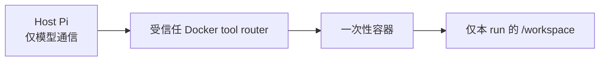

# Candidate 与隔离 Replay

状态：领域逻辑、sandbox 边界与 fake 测试已实现；尚无真实 candidate replay  
更新日期：2026-07-26

## 1. CandidateSkill

一个 `optimization.hypothesis.v1` 只生成一个原子 CandidateSkill。创建时
`CandidateRepository` 保存：

```text
.skill-evolution/candidates/<candidate-id>/
├── manifest.json
├── parent-snapshot/
├── workspace/
├── content/
└── diff.patch
```

- `parent-snapshot/` 是父 SkillVersion 的完整副本；
- `workspace/` 是 CandidateProposer 唯一可编辑的位置；
- `content/` 是完成后冻结的完整可执行内容；
- `diff.patch` 是 framework 比较父快照和 candidate 内容后计算的 unified diff；
- `manifest.json` 保存文件增删改清单、来源 hypothesis、状态和 comparison 引用。

二进制文件不能生成文本 patch 时，manifest 仍记录 operation 和修改前后 bytes。
Symlink skill 被拒绝。冻结前 framework 检查 active parent 未被修改，且 candidate
仍含 `SKILL.md`。自动 comparison 还会分别加载 baseline 和 candidate 的已批准
`skill_contract.json`；两份 contract 必须完全相同，候选不能借修改 Contract 扩大
工具、权限、网络或评测边界。

CandidateProposer 自报的 diff 不作为权威事实；它只能返回修改摘要、实际触及文件
和 evidence。没有变化、非法内容或 proposer 失败都会形成可见的
`proposal_failed` candidate。

## 2. 默认 comparison 计划

`comparison.experiment.v1` 使用新鲜 baseline，不复用问题发现阶段的五次 replay：

1. candidate 在触发 TaskCase 上 smoke 1 次；
2. smoke 成功后，在触发 TaskCase 上 baseline/candidate 各 3 次；
3. 在回归 TaskCase 上 baseline/candidate 各 3 次；
4. 共 13 次。

同一 TaskCase、同一 repetition 内交替顺序：

- 奇数 repetition：baseline → candidate；
- 偶数 repetition：candidate → baseline。

这只能降低时间漂移，不能消除模型随机性。超过 13 次需要创建扩展
ReplayExperimentRequest，由项目负责人批准。

Smoke 后先生成一个单 run Harness batch；失败时 comparison 进入
`not_runnable`，该 attempt 和 Harness 仍保留。全部 paired run 完成后，
`ComparisonHarnessRunner` 把所有 attempt 复制为不可变 replay-shaped batch，再
生成一个覆盖全部 run 的统一 Harness。这样 Profiler 汇总和 Comparator pairwise
使用同一批 baseline/candidate 数据，而不是为每条 run 重复发明比较口径。

## 3. Fail-closed sandbox

自动 replay 不允许直接使用 Pi 内置宿主机工具。



`DockerSandbox.preflight` 检查：

- Docker CLI 存在；
- Docker daemon 可访问；
- 指定 image 已在本地存在。

框架不会隐式下载 image。Preflight 失败时：

- comparison 状态为 `awaiting_sandbox`；
- candidate 同步为 `awaiting_sandbox`；
- 保存 backend、时间和失败原因；
- 不创建宿主机 fallback run。

Preflight 通过后，每个 attempt 创建独立容器：

- 只挂载该 attempt 的 `artifacts/` 到 `/workspace`，trajectory、session 和
  manifest 不暴露给容器工具；
- `--network none`；
- root filesystem 只读；
- drop all capabilities；
- `no-new-privileges`；
- 限制 PID、内存和临时目录；
- 模型 credential 留在 Host Pi，不进入容器。

`extensions/docker-tool-router.ts` 只通过 `docker exec` 提供
read/write/edit/bash。路径必须是 workspace 下相对路径。

`SandboxedPiReplayRunner` 是 production `RunAttempt`：它验证 container backend、
无网络、无 credential、host workspace 和 Docker tool environment，随后以
`--no-builtin-tools` 启动 Host Pi。Comparison 会拒绝未声明
`built_in_tools=false`、`host_fallback_allowed=false` 的任意 callback。

## 4. Harness 与效果判断

Baseline 和 candidate 的每个 run 都被纳入相同版本的 full batch：

- `trajectory.profile.v1`
- `artifact.comparison.v1`

ReplayJudge 必须是与 CandidateProposer 不同的 AgentRun。它读取全部 attempts、
失败、Profiler、Comparator 和原始 evidence，输出 `test.effect.v1`：

- runnable / complete；
- 每个维度的 improved/regressed/unchanged/inconclusive；
- regressions；
- uncertainties；
- EvidenceRef；
- 最终五类 gate。

Gate 不接受单一加权总分。正确性和能力覆盖是硬约束，hypothesis 还可以增加保护
维度。Framework 会重新计算分类，拒绝与规则不一致的 Judge 自报 classification。

运行 Judge 前，`ComparisonEvidenceBundleBuilder` 冻结 full batch trajectory、
artifacts、Harness 报告、comparison manifest、candidate manifest 和 framework
diff；Pi session 仍只作为诊断 sidecar，不进入 Judge evidence。Judge 的每个
EvidenceRef 必须在该 bundle 内验证通过。非法输出或失败 Judge AgentRun 会追加到
`judge_attempts`，不会覆盖，之后可用全新 AgentRun 重试。

## 5. Gate 和人工审阅

五种 gate 分类是：

- `improved`
- `regressed`
- `mixed`
- `inconclusive`
- `not_runnable`

无论分类是什么：

- candidate 不删除；
- diff 不删除；
- 所有 attempts、失败和 Harness 结果不删除；
- candidate 最终进入人工审阅。

`review.package.v1` 必须披露：

1. skill 是什么；
2. trajectory 长什么样；
3. 发现的问题是什么；
4. 提出的修复长什么样；
5. 为什么证据支持或不支持该修复。

自动 gate 不能发布。人工只能显式记录 `approved_for_release` 或 `rejected`。
发布后的 SkillVersion 写入、版本日志和回滚流程仍是后续集成项。

## 6. 当前状态

当前仓库已经实现 CandidateRepository、ComparisonRepository、
CandidateWorkflow、DockerSandbox、SandboxedPiReplayRunner、
ComparisonHarnessRunner、Docker tool router、TestEffect 校验和 ReviewRepository，
并用 attested fake runner/假 Pi 覆盖主要状态和失败路径。

截至本文更新时：

- 没有真实 CandidateProposer AgentRun；
- 没有真实 candidate；
- 没有执行 Docker candidate replay；
- 没有真实 ReplayJudge；
- 没有发布 skill。

开始真实验证前，必须先审核 candidate proposer、replay judge 和 execution v2
prompts，并确保 Docker preflight 通过。
