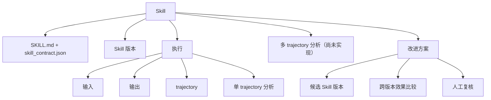

# Skill-first hierarchy

> Purpose: define the implemented Skill → Execution data model, ownership,
> application services, migration workflow, and read-only navigation.

状态：Skill-first 历史切换和中文管理界面已完成；内部 Harness-first 研究结果板已实现，
但正式产品多 trajectory Analysis、未来执行一致性与改进方案统一仍是后续工作。

## User model

The product has one primary path:



界面不要求用户先进入版本层。每次执行仍只绑定一个不可变 Skill 版本，版本作为筛选项和
易懂标签出现，并通过问号解释其用途。

## Structured Skill JSON boundary

The framework deliberately does not add a second authoritative `skill.json`.
The structured responsibilities are separated instead:

- package-local `skill_contract.json` is the human-reviewed Skill identity,
  runtime boundary, approval state, and EvaluationSuite binding;
- `revision.json` is the immutable snapshot identity for the exact package that
  an Execution used;
- `execution.json` records one run's Input, Output, Trajectory, session, status, and
  provenance;
- `analysis.json` attaches analysis to an Execution or same-Revision Execution
  Set;
- generated `index.json` and `catalog.json` are disposable navigation caches,
  never sources of truth.

This avoids duplicating Contract fields into a mutable Skill aggregate. If a
future registry needs ownership, lifecycle, aliases, dependency locks, or
search metadata beyond the Contract, it should add a separately versioned
registry record after an accepted decision; it must not silently turn the
cache into an authoritative `skill.json`.

## Authoritative runtime objects

```text
.skill-evolution/
├── catalog.json
├── hierarchy-cutover.json
├── skills/<skill-id>/
│   ├── index.json
│   ├── revisions/<revision-id>/revision.json
│   ├── revisions/<revision-id>/package/...
│   ├── execution-sets/<set-id>/set.json
│   ├── execution-sets/<set-id>/analyses/<analysis-id>/...
│   ├── executions/<execution-id>/execution.json
│   ├── executions/<execution-id>/payload/...
│   ├── executions/<execution-id>/analyses/single/<analysis-id>/...
│   ├── multi-trajectory-analyses/<analysis-id>/...
│   └── improvements/<candidate-id>/...
└── migrations/<migration-id>/manifest.json
```

`catalog.json` and `index.json` are rebuildable navigation caches. All other
manifests above are authoritative. Payload keeps the captured runtime-relative
layout; the framework does not rename a sealed legacy `trajectory.jsonl` merely
to make its directory look current.

The implemented strict contracts are:

- `skill.revision.v1`: content hash, file inventory, Contract snapshot status,
  lifecycle, and legacy identity resolution.
- `skill.execution.v1`: Skill/Revision binding, lifecycle, task snapshot,
  role-based artifacts, Trajectory/session references, origin, and provenance.
- `execution.set.v1`: one ordered, same-Revision collection used for replay,
  evaluation, or diagnostics.
- `analysis.record.v1`：把一次分析挂到单次执行或一个执行批次。
- `analysis.multi_trajectory_view.v1`：为未来多 trajectory 分析预留的严格用户报告格式；当前没有
  生产流程会生成已验证结果。

`skill.contract.v2` is unchanged. It binds stable Skill identity, approval,
runtime boundaries, and EvaluationSuite references. Runtime counters or object
IDs never enter it.

## Application behavior

- Single capture registers the complete package Revision before creating an
  Execution and writes directly to its `payload/`.
- Replay first creates an Execution Set, then creates direct Skill children that
  all reference the set's Revision.
- Harness 消费一个执行批次，但它只产出确定性检查结果，不是多 trajectory 分析。它的画像、
  文件比较和截图属于批次检查，不进入多 trajectory 分析存放位置，也不出现在对应页面。
- 新的内部研究批次可保存确定性基线、两次盲测和四份不聚合 Specialist 结果；这些对象
  仍不是正式产品 Analysis，不写入 `multi-trajectory-analyses`。
- Deterministic precheck and semantic single-Trajectory analysis accept an
  Execution reference. AgentRun attempts and evidence live under that
  Execution's analysis directory.
- 旧多角色流程不等于已实现的多 trajectory 分析。只有未来明确生成 `multi_trajectory` 类型、通过
  严格校验并写入独立位置的结果，才允许在产品中显示。
- Candidate content should become a new `candidate` Revision. Comparison may
  bind baseline and candidate Revisions explicitly; its Execution members use
  `origin: comparison`, and Review remains human-only. The current
  hierarchy-shaped Improvements prototype is not yet compatible with the
  accepted `candidate.skill.v1`, `comparison.experiment.v1`, and
  `review.package.v1` chain. It must be replaced by an ownership adapter, not
  promoted as a parallel lifecycle.

`hierarchy-cutover.json` is the explicit authority boundary. Compatibility APIs
switch to hierarchy projection only when this completed marker is present; the
mere existence of one Skill directory is not enough.

Normal initialization creates only `skills/` and `migrations/`. Deprecated
workflow roots can be created only by explicit compatibility code and are not a
normal new-write path.

Two application-boundary repairs remain for future new executions. Capture and
Replay must execute the already-registered Revision snapshot rather than copy
the mutable source package a second time. Harness and analysis compatibility
projections must replace temporary materialization paths with stable hierarchy
references before new reports are preserved. These do not invalidate the
completed historical migration, whose payload hashes were verified before
commit.

## Skill Explorer API

The primary read-only endpoints are:

```text
GET /api/skills
GET /api/skills/<skill-id>
GET /api/skills/<skill-id>/revisions
GET /api/skills/<skill-id>/executions
GET /api/skills/<skill-id>/executions/<execution-id>
GET /api/skills/<skill-id>/executions/<execution-id>/analyses
GET /api/skills/<skill-id>/analyses/multi
GET /api/skills/<skill-id>/analyses/multi/<analysis-id>
GET /api/skills/<skill-id>/improvements
```

Declared Execution files use a stable file ID under
`.../executions/<execution-id>/files/<file-id>/preview|download`. A caller cannot
supply an arbitrary path. HTML preview retains the CSP sandbox and the server
continues to accept only loopback Host values and `GET|HEAD`.

Deprecated `/api/campaigns/...` routes are projected from Execution Sets after
migration. They do not restore Campaign as an authoritative top-level object.

The HTTP surface accepts only `GET|HEAD`, and catalog/index reads never rebuild
or write files. Writers and migration maintain those caches. 页面以中文为主，左侧按
`Skill → trajectory → 单 trajectory 分析` 展开；执行卡片只显示任务摘要，完整任务要求单独展开；
状态显示中文，Skill 版本和执行批次等术语带问号解释。页面会保存 Skill、执行、页签和
trajectory 位置；多 trajectory 页面当前固定读取独立空存放位置，因此不显示旧批次检查。

## Migration and cutover

Generate a dry-run manifest without moving source data:

```bash
python3 scripts/migrate_skill_hierarchy.py
```

The result is stored under
`.skill-evolution/migrations/<migration-id>/manifest.json`. A ready plan contains
the complete source inventory and SHA-256 digest, Skill mapping, Revision,
Execution Set, Execution and analysis destinations, plus reversible move
records. Any ambiguous identity, orphan evidence, exploratory root, or changed
source blocks apply.

Applying is intentionally a separate, exact-confirmation operation:

```bash
python3 scripts/migrate_skill_hierarchy.py \
  --apply \
  --migration-id <migration-id> \
  --confirm-migration-id <same-migration-id>
```

Do not run this command merely because a dry-run exists. The project owner must
first review the exact object list. Before the atomic Skill-root commit, the
migrator checks that payload file inventories match. A pre-commit interruption
moves every source back and records `rolled_back`; it never unlocks a partial
hierarchy.

Historical packages without a Contract create an explicit legacy Revision with
`contract.status: missing_at_execution`. The later approved Contract is not
copied into that historical identity.

## Current cutover state

Migration `hierarchy-migration-20260809-cutover` completed with 340 preserved
source files and a verified source digest. The authoritative hierarchy now has:

- one document HTML Skill;
- one historical Revision with `missing_at_execution` Contract state and one
  current active Revision with the approved Contract;
- two replay Execution Sets, all ten replay Executions, and one complete
  standalone historical Execution;
- ten single-trajectory analyses, including five exact `invalid_output` semantic
  states;
- zero multi-trajectory analyses. The seven historical Harness or unfinished
  multi-role records were reclassified as not being multi-trajectory analysis and
  removed from the product read path. Their permanent deletion is pending
  explicit authorization covering all seven records.

The standalone legacy run was migrated because its frozen package and sealed
Trajectory validate. Four pre-canonical spike attempts lacked both an immutable
package snapshot and a sealed canonical Trajectory, so they could not truthfully
become Executions. They were excluded from product data and permanently deleted
after explicit owner approval on 2026-08-10; they are not recoverable from the
runtime.

Dependency Graph, RAG, remote Registry, and large-scale search are not part of
this implementation.
